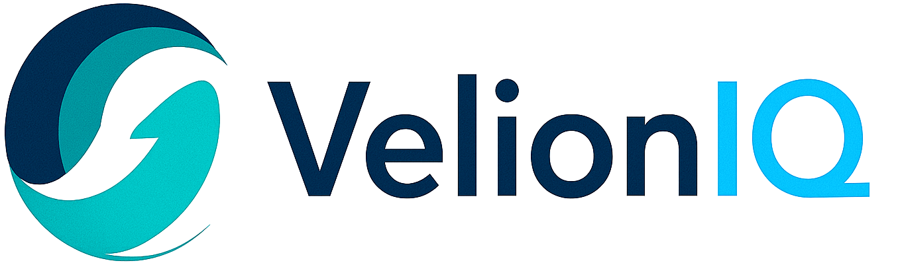

# 🚀 VelionIQ - AI-Powered Business Tool Suite

<div align="center">
  
  
  [](https://reactjs.org/)
  [](https://vitejs.dev/)
  [](https://tailwindcss.com/)
  [](https://www.framer.com/motion/)
</div>

## 📋 Overview

VelionIQ is a modern, professional Single Page Application (SPA) showcasing an AI-powered business automation platform. This project demonstrates enterprise-level frontend development with cutting-edge technologies, featuring a comprehensive suite of 6 AI tools designed to revolutionize business operations.


## ✨ Key Features

### 🎯 **Core Functionality**
- **6 AI-Powered Products**: Complete suite including Flowgenix, AutoRecon, PriceGuard, SmartSpec, InboxIntelli, and ClaimWise
- **Responsive Design**: Mobile-first approach with seamless cross-device experience
- **Advanced Animations**: Sophisticated motion design using Framer Motion and AOS
- **Video Integration**: Hero section with autoplay background video
- **Interactive Contact Form**: Full-featured form with validation and local storage

### 🎨 **Design & UX**
- **Modern UI/UX**: Clean, professional design with custom component library
- **Advanced Navigation**: Responsive navbar with dropdown menus and scroll effects
- **Micro-interactions**: Hover effects, loading states, and smooth transitions
- **Custom Design System**: Comprehensive color palette and typography scale
- **Performance Optimized**: Fast loading with optimized assets and code splitting

## 🛠️ Tech Stack

### **Frontend Framework**
- **React 19.1.0** - Latest React with modern hooks and concurrent features
- **Vite 6.3.5** - Lightning-fast build tool and development server
- **React Router DOM 7.6.2** - Client-side routing for seamless navigation

### **Styling & Design**
- **Tailwind CSS 3.4.1** - Utility-first CSS framework with custom configuration
- **PostCSS** - CSS processing and optimization
- **Google Fonts (Inter)** - Professional typography system

### **Animation & Interaction**
- **Framer Motion 12.19.1** - Production-ready motion library
- **AOS 2.3.4** - Animate On Scroll library
- **React CountUp 6.5.3** - Animated number counters
- **React Intersection Observer 9.16.0** - Viewport detection hooks

### **Icons & Assets**
- **Lucide React 0.515.0** - Beautiful, customizable icon library
- **Lottie React 2.4.1** - Lightweight SVG animations

### **Development Tools**
- **ESLint 9.25.0** - Code quality and consistency enforcement
- **Modern ES6+** - Latest JavaScript features and best practices

## 🏗️ Project Structure

```
📦 VelionIQ-Website
├── 🔧 Configuration
│   ├── vite.config.js          # Build configuration
│   ├── tailwind.config.js      # Custom design system
│   ├── eslint.config.js        # Code quality rules
│   └── postcss.config.js       # CSS processing
│
├── 🌐 Public Assets
│   ├── favicon.png             # Site favicon
│   ├── logo.png                # Brand logo
│   └── motion-graphics.mp4     # Hero background video
│
├── 💻 Source Code
│   ├── 📄 Pages (11 routes)
│   │   ├── Home.jsx            # Landing page
│   │   ├── About.jsx           # Company information
│   │   ├── Industries.jsx      # Target industries
│   │   ├── Resources.jsx       # Content hub
│   │   └── Product Pages/      # Individual product showcases
│   │       ├── ClaimWise.jsx   # Warranty claim validation
│   │       ├── Flowgenix.jsx   # Document automation
│   │       ├── AutoRecon.jsx   # Product matching
│   │       ├── PriceGuard.jsx  # Rate anomaly detection
│   │       ├── SmartSpec.jsx   # Specification tracking
│   │       └── InboxIntelli.jsx # Email-to-ERP bridge
│   │
│   ├── 🧩 Components (11 reusable)
│   │   ├── Layout.jsx          # App shell
│   │   ├── NavBar.jsx          # Advanced navigation
│   │   ├── HeroSection.jsx     # Video hero component
│   │   ├── ContactForm.jsx     # Functional contact form
│   │   ├── ProductTile.jsx     # Product showcase cards
│   │   ├── ImpactStats.jsx     # Animated statistics
│   │   ├── TestimonialsSection.jsx # Social proof
│   │   ├── Footer.jsx          # Site footer
│   │   └── Utility Components/ # Badges, modals, etc.
│   │
│   └── 🎨 Styling
│       ├── index.css           # Global styles
│       └── assets/             # Images and media
```

## 🚀 Getting Started

### Prerequisites
- **Node.js** (v18 or higher)
- **npm** or **yarn**

### Installation

1. **Clone the repository**
   ```bash
   git clone https://github.com/whenrohitcodes/VelionIQ-website.git
   cd VelionIQ-website
   ```

2. **Install dependencies**
   ```bash
   npm install
   ```

3. **Start development server**
   ```bash
   npm run dev
   ```

4. **Open your browser**
   Navigate to `http://localhost:5173`

### Available Scripts

```bash
npm run dev      # Start development server
npm run build    # Build for production
npm run preview  # Preview production build
npm run lint     # Run ESLint checks
```

## 🎨 Design System

### Color Palette
- **Primary**: Blue gradient system (50 shades)
- **Secondary**: Gray-blue neutrals for text and UI elements
- **Accent**: Purple/magenta for highlights and CTAs
- **Semantic**: Green (success), Yellow (warning), Red (error)

### Typography
- **Font Family**: Inter - Modern, professional typeface
- **Scale**: Responsive typography with display fonts for headings
- **Weights**: 400 (regular), 600 (semibold), 700 (bold)

### Target Industries
- Manufacturing & Supply Chain
- E-commerce & Retail
- Financial Services
- Healthcare & Insurance
- Automotive & Equipment
---

<div align="center">
  <p>⭐ Star this repository if you found it helpful!</p>
</div>
